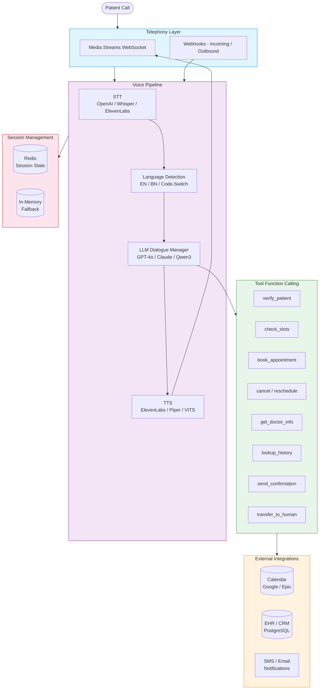
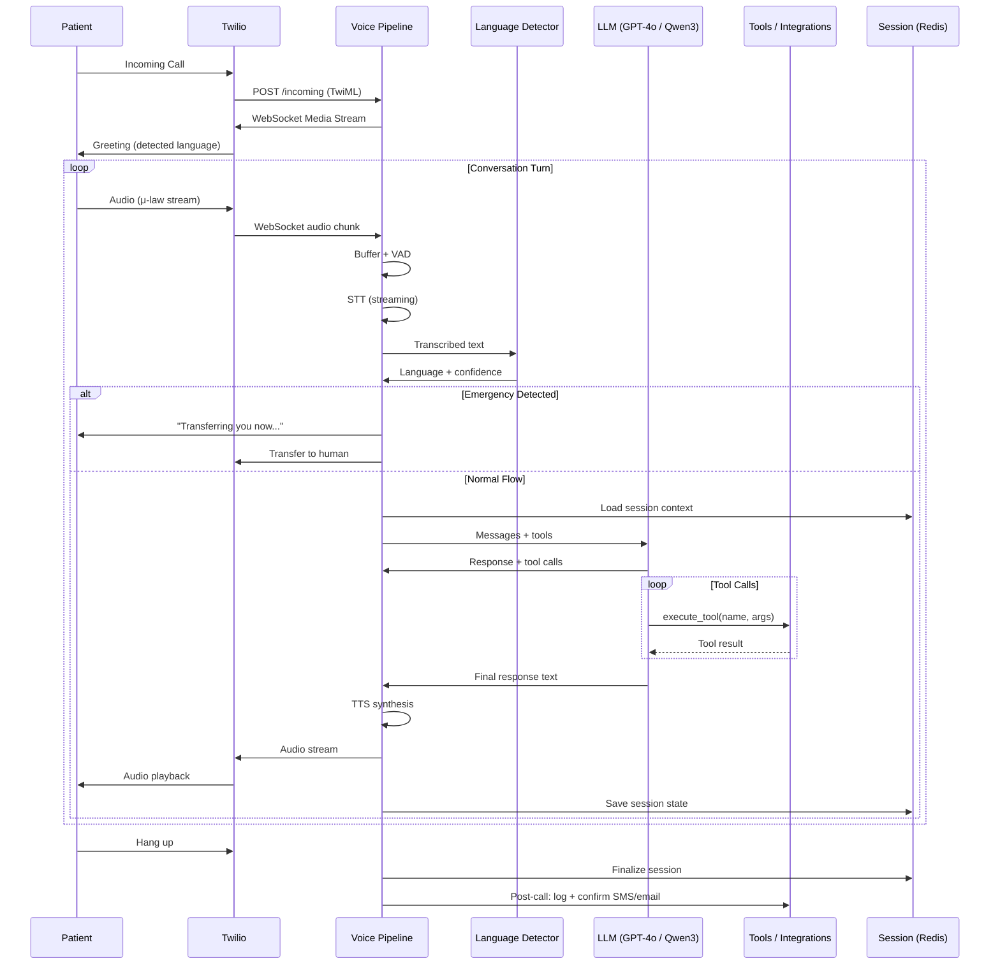
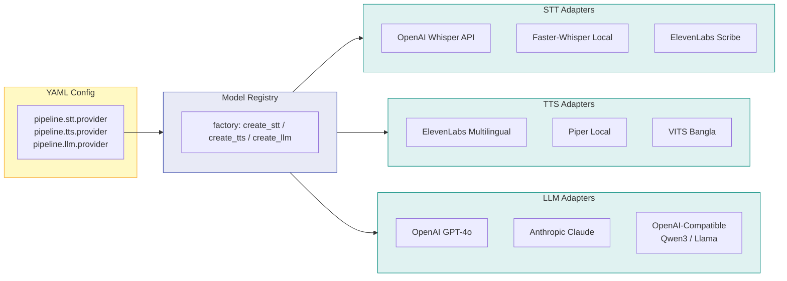

# Sefa - Medical Voice Agent

HIPAA-compliant, bilingual (English / Bangla) voice AI receptionist for healthcare. Automates inbound patient calls, outbound reminders, appointment scheduling, and clinical triage routing with full code-switching support.

## Architecture

### High-Level System Flow



### Call Flow Sequence



### Model Abstraction Layer



## Features

- **Bilingual**: Automatic EN/BN detection, code-switching ("Doctor er appointment কখন?"), language-appropriate responses
- **Hybrid Models**: Swap STT/TTS/LLM providers via YAML config — no code changes
- **9 Tool Functions**: Patient verification, appointment CRUD, doctor lookup, history, confirmations, human escalation
- **Real-time Pipeline**: Streaming STT with VAD, silence-based turn detection, barge-in support
- **HIPAA Compliance**: PHI masking in logs, audit trails, AES-256 encryption support, consent-based recording
- **Emergency Detection**: Bilingual keyword detection with automatic human escalation

## Prerequisites

- Python 3.11+
- [uv](https://docs.astral.sh/uv/) package manager
- Redis (for session management in production)
- Twilio account (for telephony)
- OpenAI API key (or local LLM endpoint)

## Quick Start

```bash
# Clone and install
git clone <repo-url> Voice_agent
cd Voice_agent

# Install all dependencies (including dev tools)
uv sync

# Set up environment
cp .env.example .env
# Edit .env with your API keys

# Run tests
uv run pytest tests/ -v

# Lint
uv run ruff check src/ tests/

# Type check
uv run mypy src/

# Start the server
uv run uvicorn sefa.main:app --host 0.0.0.0 --port 8000 --reload
```

## Configuration

All configuration lives in `configs/default.yaml`. Environment variables are resolved from `${VAR_NAME}` references.

### Key Config Sections

```yaml
# Language support
languages:
  primary: "en"
  supported: ["en", "bn"]
  code_switching: true

# Model routing — swap providers here
pipeline:
  stt:
    provider: "openai"        # openai | whisper_local | elevenlabs
  tts:
    provider: "elevenlabs"    # elevenlabs | piper | vits
  llm:
    provider: "openai"        # openai | anthropic | qwen_local

# Local model alternatives
models:
  adapters:
    stt_whisper_local:
      type: "whisper_local_stt"
      model_size: "large-v3"
      bangla_finetuned: true
    llm_qwen_local:
      type: "openai_compatible_llm"
      base_url: "http://localhost:8080/v1"
      model: "qwen3-8b"
```

### Environment Variables

| Variable | Description | Required |
|----------|-------------|----------|
| `OPENAI_API_KEY` | OpenAI API key (for STT + LLM) | Yes (if using OpenAI) |
| `ELEVENLABS_API_KEY` | ElevenLabs API key (for TTS/STT) | Yes (if using ElevenLabs) |
| `ANTHROPIC_API_KEY` | Anthropic API key (for Claude LLM) | No |
| `TWILIO_ACCOUNT_SID` | Twilio account SID | Yes (for telephony) |
| `TWILIO_AUTH_TOKEN` | Twilio auth token | Yes (for telephony) |
| `TWILIO_PHONE_NUMBER` | Twilio phone number | Yes (for telephony) |
| `DATABASE_URL` | PostgreSQL connection string | No (SQLite fallback) |
| `REDIS_URL` | Redis connection string | No (in-memory fallback) |

## Project Structure

```
src/sefa/
├── main.py                    # FastAPI application entry point
├── config/
│   └── settings.py            # Pydantic settings from YAML + env vars
├── models/
│   ├── base.py                # ABC interfaces (BaseSTT, BaseTTS, BaseLLM)
│   ├── registry.py            # Config-driven model factory
│   ├── stt/                   # Speech-to-Text adapters
│   │   ├── openai_stt.py      #   OpenAI Whisper API
│   │   ├── whisper_local.py   #   Faster-Whisper (local GPU)
│   │   └── elevenlabs_stt.py  #   ElevenLabs Scribe
│   ├── tts/                   # Text-to-Speech adapters
│   │   ├── elevenlabs_tts.py  #   ElevenLabs Multilingual
│   │   ├── piper_tts.py       #   Piper (local, low-latency)
│   │   └── vits_tts.py        #   VITS (Bangla fine-tuned)
│   └── llm/                   # Large Language Model adapters
│       ├── openai_llm.py      #   GPT-4o
│       ├── anthropic_llm.py   #   Claude 3.5
│       └── openai_compatible_llm.py  # Local (Qwen, Llama, etc.)
├── telephony/
│   └── twilio.py              # Twilio webhooks + Media Streams WS
├── pipeline/
│   ├── voice_pipeline.py      # Real-time STT → Lang → LLM → TTS loop
│   └── language_detector.py   # EN/BN detection + code-switching
├── session/
│   └── manager.py             # Redis/in-memory session with history
├── tools/
│   ├── definitions.py         # 9 LLM function-calling tool schemas
│   └── executor.py            # Tool dispatch and execution
├── integrations/
│   ├── calendar.py            # Google Calendar / custom booking
│   ├── ehr.py                 # EHR patient data integration
│   └── notifications.py       # Bilingual SMS/email templates
└── utils/
    ├── compliance.py          # HIPAA audit logging, PHI masking
    └── logging.py             # Structured logging (structlog)
```

## Design & Planning Docs

- [`docs/designs/shefa-spec-epic-plan.md`](docs/designs/shefa-spec-epic-plan.md) — the
  approved epic: 8 code children, Child 0 "Developer loop", cross-model scope decisions.
- [`docs/designs/shefa-first-clinic.md`](docs/designs/shefa-first-clinic.md) — the original
  41-item first-clinic plan (Shadow Line + Door-Opener) with the full CEO/Design/DX/Eng review record.
- [`docs/designs/shefa-first-clinic-disposition.md`](docs/designs/shefa-first-clinic-disposition.md) —
  T16 (Child 0) artifact: every original plan item (T/D/X/E tasks plus the CEO/Design/DX/Eng
  accepted blocks) mapped to a child as IN / RE-SCOPED / DROPPED with rationale.
  T7 (full-disk encryption + named raw-audio deletion) is promoted into Child 3;
  T6 (outreach tracker) is dropped because outreach is the gate, not code (Q6).

## API Endpoints

| Method | Path | Description |
|--------|------|-------------|
| `GET` | `/health` | Health check |
| `GET` | `/` | Service info |
| `POST` | `/api/v1/telephony/incoming` | Twilio incoming call webhook |
| `POST` | `/api/v1/telephony/outbound` | Initiate outbound call |
| `WS` | `/api/v1/telephony/media-stream/{call_sid}` | Bidirectional audio stream |

## Tool Functions (LLM callable)

| Tool | Description |
|------|-------------|
| `verify_patient` | Verify identity via name/DOB/phone/MRN |
| `check_appointment_slots` | Query available slots by date/doctor |
| `book_appointment` | Book appointment for verified patient |
| `cancel_appointment` | Cancel existing appointment |
| `reschedule_appointment` | Move appointment to new date/time |
| `get_doctor_info` | Doctor profile, availability, languages |
| `lookup_patient_history` | Recent visits, medications, allergies |
| `send_confirmation` | Bilingual SMS/email confirmation |
| `transfer_to_human` | Escalate to human receptionist |

## Running Locally with Local Models

### Option 1: OpenAI stack (easiest)

```bash
# Requires OPENAI_API_KEY in .env
uv run uvicorn sefa.main:app --port 8000 --reload
```

### Option 2: Fully local (Qwen3 + Faster-Whisper)

```bash
# Install local extras
uv sync --extra local-stt --extra local-tts

# Start Qwen3-8B with vLLM
vllm serve Qwen/Qwen3-8B --port 8080

# Update configs/default.yaml
# pipeline.stt.provider: "whisper_local"
# pipeline.llm.provider: "qwen_local"
# pipeline.tts.provider: "piper"

uv run uvicorn sefa.main:app --port 8000 --reload
```

## Testing

```bash
# Run all tests
uv run pytest tests/ -v

# With coverage
uv run pytest tests/ --cov=sefa --cov-report=html

# Run specific test module
uv run pytest tests/unit/test_language_detector.py -v
```

## Deployment

### Docker (recommended)

```dockerfile
FROM python:3.11-slim
RUN pip install uv
WORKDIR /app
COPY pyproject.toml uv.lock ./
RUN uv sync --no-dev
COPY src/ src/
EXPOSE 8000
CMD ["uv", "run", "uvicorn", "sefa.main:app", "--host", "0.0.0.0", "--port", "8000"]
```

### Kubernetes

- Horizontal pod autoscaler based on concurrent call count
- Redis for session state (shared across pods)
- HIPAA-eligible cloud: AWS GovCloud, Azure Healthcare, or GCP Healthcare API

## Production Checklist

- [ ] Set `ENVIRONMENT=production` in `.env`
- [ ] Configure HIPAA-compliant storage for call recordings
- [ ] Set up BAA with cloud provider (Twilio, OpenAI, etc.)
- [ ] Enable Prometheus metrics (`monitoring.prometheus_enabled: true`)
- [ ] Configure Sentry DSN for error tracking
- [ ] Set up log shipping (ELK/Loki) with PHI masking enabled
- [ ] Load test with 50+ concurrent bilingual calls
- [ ] Verify WER < 8% on Bangla medical corpus
- [ ] Test emergency escalation flow end-to-end
- [ ] Validate DTMF fallback for identity verification

## License

Proprietary. All rights reserved.
